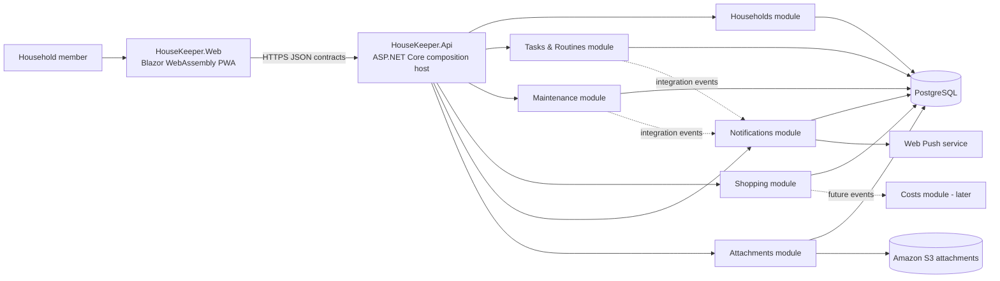
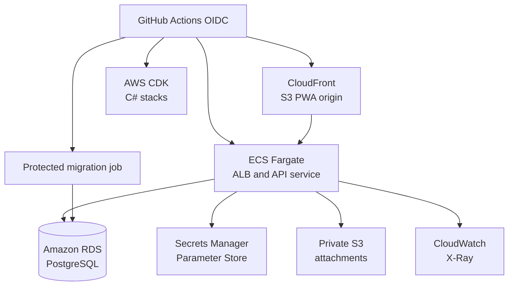

# HouseKeeper Technical Recommendation

**Status:** Foundation baseline
**Decision date:** 26 July 2026
**Scope:** Discovery 0 and the transition into Foundation
**Implementation evidence:** HK-14 walking skeleton, merged through PR #2

## Executive decision

HouseKeeper will be delivered as an AWS-first .NET 10 modular monolith with an independently deployable mobile-first Blazor WebAssembly PWA, an ASP.NET Core API, PostgreSQL persistence, and module-owned data boundaries.

The recommendation intentionally optimises for one developer, a small initial user base, South African hosting locality, rapid product learning, and a credible growth path without adopting distributed-system complexity before it is justified.

The approved baseline is:

| Concern | Decision |
|---|---|
| Product client | Mobile-first standalone Blazor WebAssembly PWA |
| Native strategy | Defer .NET MAUI Blazor Hybrid until measured browser limitations justify it |
| Runtime | .NET 10 LTS targeting `net10.0` |
| Server | ASP.NET Core Minimal API composition host |
| Architecture | Modular monolith; one backend deployable and one module assembly per meaningful capability |
| Persistence | PostgreSQL with EF Core/Npgsql; one physical database and module-owned schemas/contexts/migrations |
| Authentication | Amazon Cognito User Pools with authorization-code flow and PKCE; development-only local identity for the inner loop |
| Authorization | Application-owned household memberships and roles; default-deny resource checks in the API |
| Async work | PostgreSQL-backed durable work records and in-process `BackgroundService` dispatch for the initial topology |
| Notifications | In-app notifications plus opt-in Web Push through a provider-neutral adapter |
| Attachments | Private Amazon S3, exact-object short-lived SigV4 presigned grants, GuardDuty Malware Protection for S3 |
| Testing | xUnit v3 on Microsoft Testing Platform v2, bUnit, Playwright, ArchUnitNET, PostgreSQL integration tests, Cobertura |
| Local orchestration | Repository scripts plus Docker Compose; .NET Aspire deferred |
| Frontend hosting | Private Amazon S3 origin behind Amazon CloudFront Origin Access Control |
| API hosting | Hardened non-root ASP.NET Core container on Amazon ECS Fargate behind an Application Load Balancer |
| Database hosting | Amazon RDS for PostgreSQL |
| Region | `af-south-1` (Africa/Cape Town) |
| Delivery | GitHub Actions OIDC to narrow IAM deployment roles, AWS CDK in C#, explicit migration tasks, protected promotion |
| Observability | CloudWatch Logs, Metrics and Alarms with OpenTelemetry-compatible tracing and X-Ray |

## Architectural principles

1. **Product boundaries before technical layers.** Business modules own their rules, persistence, and public contracts.
2. **One deployable until operational evidence says otherwise.** Compile-time separation is required; network separation is not.
3. **The browser is untrusted.** Secrets, privileged credentials, authorization enforcement, and business invariants remain server-side.
4. **One owner for every table and state transition.** Cross-module access occurs through purpose-specific contracts or immutable integration events.
5. **Durable state before background execution.** Timers and in-memory queues are never the source of truth.
6. **Explicit migrations.** The API does not mutate production schemas during startup.
7. **Measured evolution.** Native hosting, Aspire, service extraction, queues, high availability, and multi-region deployment are revisit decisions, not default architecture.

## Logical architecture



### Cross-module consistency

- A command transaction is local to one module.
- Synchronous contracts are used only when an immediate answer is required.
- Integration events represent already-committed facts and are idempotently consumed.
- No command handler performs cross-module SQL joins or mutates another module's schema.
- Cross-module identifiers are scalar values without ORM navigation properties.
- Durable outbox/inbox delivery is introduced for business-critical cross-module events before multiple active API replicas or independent worker hosts are adopted.

## Deployment architecture



Production deployment rules:

- Build frontend and API artifacts once and promote the same immutable artifacts.
- Authenticate GitHub Actions to AWS using OpenID Connect federation and narrow IAM deployment roles.
- Use ECS task roles and service-linked roles for AWS access; do not put AWS credentials in the container or PWA.
- Use a separate migration identity with narrower and temporary deployment access.
- Run `cdk synth --strict`, policy/security checks and reviewed `cdk diff` before environment changes.
- Apply reviewed migration scripts before deploying code that requires the schema.
- Run readiness and end-to-end smoke checks after deployment.
- Retain previous application artifacts and migration manifests for rollback analysis.

## Repository and dependency model

### Current repository shape

```text
HouseKeeper/
├── HouseKeeper.slnx
├── global.json
├── Directory.Build.props
├── Directory.Packages.props
├── README.md
├── src/
│   ├── HouseKeeper.Api/
│   ├── HouseKeeper.Web/
│   ├── HouseKeeper.Contracts/
│   └── Modules/
│       └── HouseKeeper.Modules.Households/
├── tests/
│   ├── HouseKeeper.ArchitectureTests/
│   ├── HouseKeeper.EndToEndTests/
│   ├── HouseKeeper.Web.Tests/
│   └── Modules/
│       └── HouseKeeper.Modules.Households.Tests/
├── scripts/
├── deploy/local/
└── .github/workflows/
```

### Target capability growth

```text
src/Modules/
├── HouseKeeper.Modules.Households/
├── HouseKeeper.Modules.Tasks/
├── HouseKeeper.Modules.Maintenance/
├── HouseKeeper.Modules.Shopping/
├── HouseKeeper.Modules.Notifications/
└── HouseKeeper.Modules.Attachments/
```

A shared `HouseKeeper.BuildingBlocks` assembly may be added only when at least two modules require the same stable, framework-light technical semantics. It must not become a generic repository, base-entity, helper, or shared-business-model project.

### Allowed references

```text
HouseKeeper.Web
    -> HouseKeeper.Contracts

HouseKeeper.Api
    -> HouseKeeper.Contracts
    -> every HouseKeeper.Modules.* assembly
    -> host-level technical packages

HouseKeeper.Modules.*
    -> HouseKeeper.Contracts
    -> approved BuildingBlocks when introduced

Module A
    -X-> Module B implementation
```

### Enforcement rules

- `HouseKeeper.Web` does not reference modules, EF Core, storage SDKs, or server infrastructure.
- `HouseKeeper.Contracts` contains serialization-safe boundary records, not entities, repositories, `IQueryable`, or framework implementations.
- The API is a composition and transport host; domain rules do not live in endpoints or middleware.
- Module implementation assemblies do not reference one another.
- Domain namespaces do not reference ASP.NET Core, EF Core, AWS SDKs, browser APIs, or endpoint types.
- Architecture tests protect these constraints on every pull request.

## Data and migration strategy

- PostgreSQL is the transactional system of record.
- Each persistent module owns a schema, `DbContext`, migration history, mappings, and data lifecycle.
- The walking skeleton proves the `households` schema and explicit migration path.
- Migration generation occurs during development; deployment consumes reviewed idempotent SQL or an equivalent reviewed artifact.
- Runtime identities do not receive schema-owner permissions.
- Changes follow expand-and-contract compatibility when zero- or low-interruption deployment is required.
- Backups are incomplete evidence until restore drills prove recovery.

Initial schema allocation:

```text
households
work
maintenance
shopping
notifications
attachments
costs          # later
```

## Identity and authorization boundary

Production authentication will use Amazon Cognito User Pools. The external identity provider proves who the subject is; HouseKeeper decides what that subject may do.

The server maps the external subject identifier to an application member and evaluates household membership and role records stored in the Households schema. Identity-provider roles are not used as the source of household authorization.

Required controls:

- default-deny access when membership cannot be proven;
- household identifier and resource ownership validation on every protected operation;
- purpose-specific authorization services rather than ad-hoc endpoint checks;
- no tenant or household trust derived from browser-supplied claims alone;
- no secrets or privileged tokens in the PWA;
- development authentication enabled only in the `Development` environment.

## Recurrence, reminders, and time

Recurring work is represented as versioned routine definitions and materialized task occurrences. Completion history belongs to occurrences and is not overwritten when a future schedule changes.

Temporal decisions:

- household and schedule time zones use IANA identifiers;
- date-only work retains date semantics and uses a required timezone snapshot for reminder conversion;
- date-only reminders default to 09:00 local time;
- existing materialized occurrences are not silently reinterpreted after household timezone changes;
- postponement and reassignment create explicit history and update reminder projections;
- Web Push is opt-in and never the authoritative record of a reminder.

## Attachment security model

- Binary content lives in private Amazon S3, not PostgreSQL or the API filesystem.
- PostgreSQL stores metadata, lifecycle, scan state, quota reservations, claims, and deletion state.
- The API grants an exact-object, short-lived SigV4 presigned upload operation after household authorization and quota checks.
- The browser uploads directly to storage and cannot list the container.
- Only attachments that pass size, signature, format, ownership, and malware checks become `Ready`.
- Business modules store opaque `AttachmentId` references and own the semantic link.
- Original filenames never form part of the object key.
- Local development uses a pinned S3-compatible emulator and deterministic scanner substitutes; real AWS integration receives focused smoke suites.

## Quality gates

Every pull request must, as applicable:

1. restore pinned tools and audited dependencies;
2. build with nullable analysis, approved analyzers, and warnings as errors;
3. run domain and application tests on xUnit v3/Microsoft Testing Platform v2;
4. run bUnit component tests;
5. run PostgreSQL-backed integration tests;
6. run architecture tests;
7. collect Cobertura coverage artifacts;
8. publish the API and PWA;
9. reject unresolved static-asset fingerprint placeholders;
10. apply migrations to a clean database;
11. run API smoke and Playwright browser journeys;
12. validate persistence across an independent API restart;
13. scan dependencies, source, and secrets;
14. retain diagnostics required to investigate a failed run.

Coverage is an observability signal, not an acceptance target by itself. Critical authorization, recurrence, migration, retry, and deletion behaviours require explicit scenario tests.

## Known risks

| Risk | Current control | Foundation response |
|---|---|---|
| Physical mobile PWA behaviour is not yet evidenced | Browser and Chromium journey pass | Run Android and iOS installation/offline/upload validation and record payload metrics |
| Production identity is not implemented | Development auth proves the middleware boundary | Integrate Cognito User Pools and retain application-owned membership checks |
| Offline business-data sync is not implemented | Online walking skeleton only | Define IndexedDB store, idempotency keys, replay rules, and conflict policy |
| In-process workers share the API lifecycle | PostgreSQL is the durable source of work | Add leasing, retry, inbox/outbox and queue-age telemetry before critical reminders |
| One backend replica is an operational coupling | Initial topology is intentionally simple | Keep one active instance; extract worker or add coordination only on measured need |
| Blazor WebAssembly payload may be slow on mobile networks | Published PWA is validated | Capture compressed payload and first-use measurements on representative South African connections |
| Attachment scanning adds cost and asynchronous failure modes | Private storage and lifecycle design accepted | Implement quotas, scanner result inbox, cleanup and budget alerts |
| ECS deployment and Fargate capacity add operational coupling | Circuit breaker, health checks and immutable images | Keep desired count and scaling conservative; add capacity only from measured load |
| Burstable RDS PostgreSQL can exhaust CPU credits | Conservative initial sizing | Load-test API plus worker traffic and monitor CPU, connections, locks and query latency |
| Backups can exist without being recoverable | Managed backups selected | Automate restore drills and record recovery observations |
| Architecture documentation can drift | Architecture tests protect code references | Treat ADR and recommendation changes as required pull-request work when boundaries change |

## Deferred decisions and revisit triggers

### .NET MAUI Blazor Hybrid
Revisit when native-only capabilities, store distribution, background upload, widgets, biometric access, advanced scanning, or browser-related support incidents become material.

### .NET Aspire
Revisit when HouseKeeper has at least two independently executable backend processes, local startup becomes repeatedly error-prone, or cross-process diagnostics and service discovery provide measurable value.

### Separate worker process or cloud scheduler
Revisit when API scale-to-zero is desired, worker resource usage affects HTTP reliability, or background work requires a distinct availability or deployment boundary.

### External broker or microservices
Revisit when a module needs materially different scaling, security, availability, ownership, or release cadence. Do not extract services merely because integration events exist.

### High availability and multi-region
Revisit before a public availability commitment or when measured recovery objectives require database HA, deployment slots, geo-redundant backups, or regional failover.

### Costs module
Remain outside MVP until household task, maintenance, and shopping workflows prove that users need consolidated household operating-cost records.

## Foundation exit definition

Foundation is complete when:

- production authentication and household authorization are exercised end to end;
- a shared development AWS environment is reproducibly provisioned in `af-south-1`;
- migrations, Secrets Manager/Parameter Store, IAM roles, telemetry and release promotion are proven;
- offline pending actions have an explicit idempotent replay contract;
- durable integration-event delivery is available for critical cross-module reactions;
- attachment upload and scan lifecycle is proven against S3 and GuardDuty Malware Protection for S3;
- physical-device PWA validation is recorded;
- the first non-Households business module follows and passes the dependency rules;
- operational runbooks cover deployment, rollback, database restore and incident triage.

The ordered work required to reach this state is maintained in [`../foundation-backlog.md`](../foundation-backlog.md).
